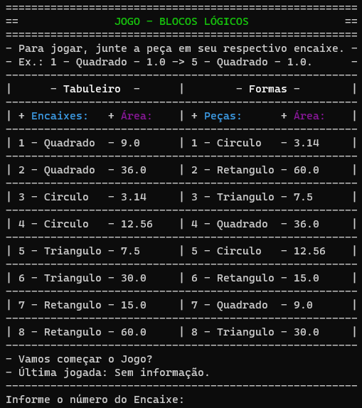
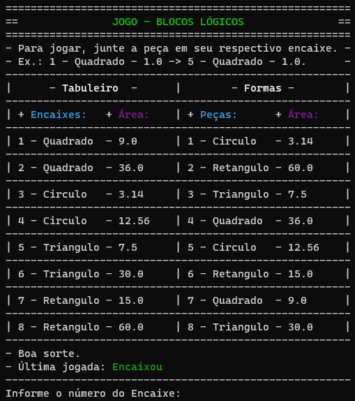
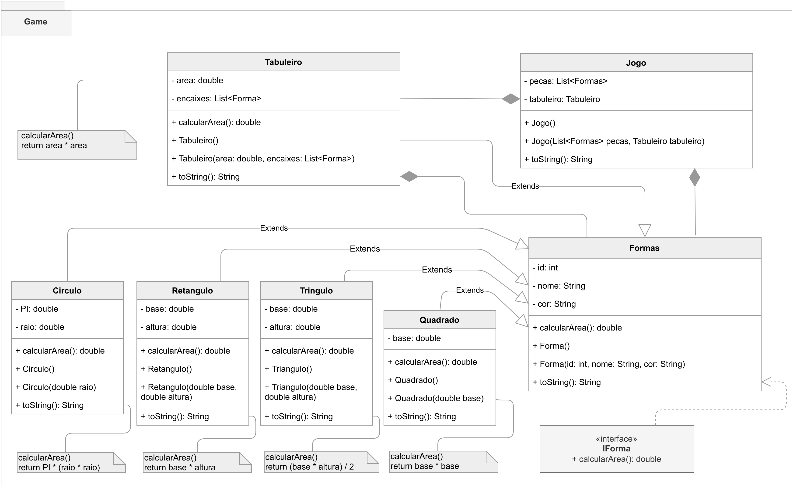
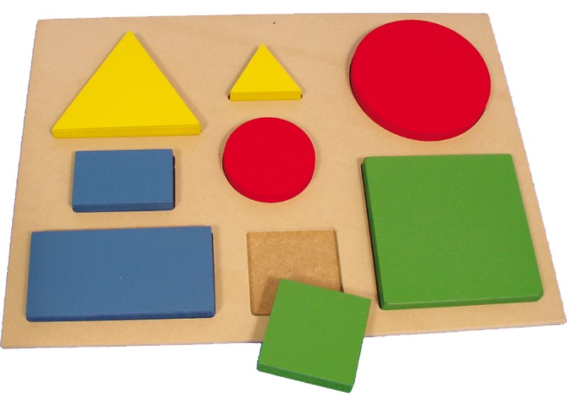

# Jogo Blocos Lógicos 
 

- Jogo desenvolvido como parte de trabalho da disciplina de Orientação a Objetos do Instituto Federal da Paraíba (IFPB).
- Game developed as part of the work of the Object Orientation course at the Instituto Federal da Paraíba (IFPB).

## Imagens do jogo em funcionemanto.

## Projeto UML

## Imagem da inspiração do jogo

