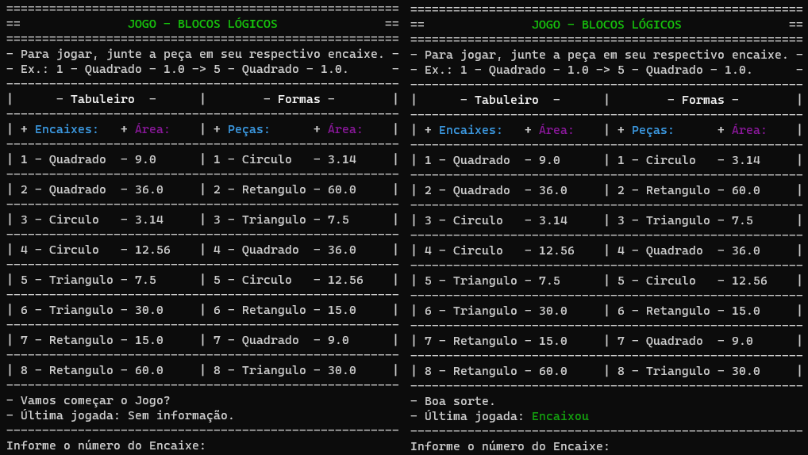

# Jogo Blocos Lógicos 
 

- Jogo desenvolvido como parte de trabalho no curso Técnico em Informática, na disciplina de Orientação a Objetos do Instituto Federal da Paraíba (IFPB) e atualizado no Curso de Ciência da Computação, na disciplina de Orientação a Objetos da Universidade Estadual da Paraíba (UEPB).
- The game was developed as part of an assignment for the Technical Computer Science course in Object Orientation at the Instituto Federal da Paraíba (IFPB) and updated for the Computer Science course in Object Orientation at the Universidade Estadual da Paraíba (UEPB).

## Imagens do jogo em funcionemanto.

## Projeto UML

## Imagem da inspiração do jogo

